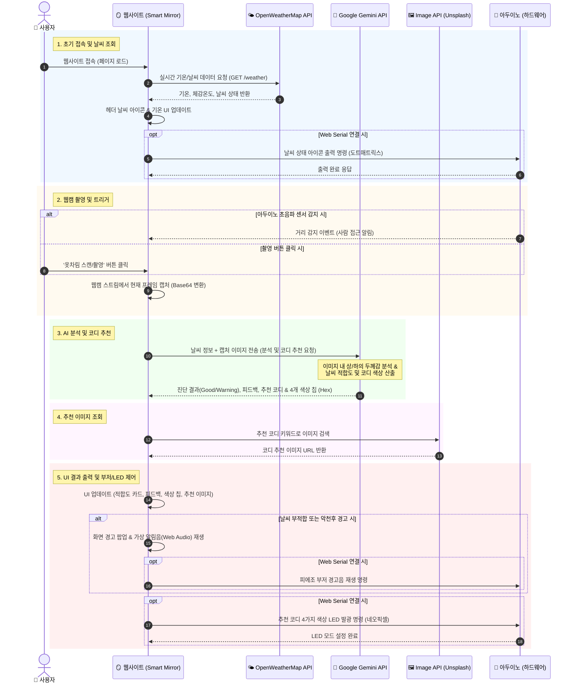
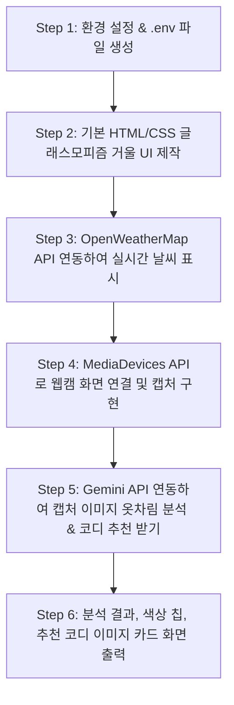

# 🪞 제품 요구사항 정의서 (PRD): 스마트 거울 비서 (Smart Mirror Assistant)

> **작성자**: IoT & Web 융합 프로덕트 매니저 (PM)  
> **버전**: v1.0  
> **최종 수정일**: 2026-07-31  
> **대상**: 웹 개발자 및 프로젝트 입문자  

---

## 1. 프로젝트 개요 (Overview)

### 1.1 프로젝트 명
**스마트 거울 비서 (Smart Mirror Assistant)**

### 1.2 프로젝트 목적
외출 전 거울을 볼 때 **현재 날씨 정보**와 **사용자의 현재 옷차림**을 웹캠으로 분석하여, 오늘 날씨에 옷차림이 적절한지 평가하고 **날씨 맞춤형 추천 코디 및 이미지**를 제공하는 스마트 웹 서비스입니다.

### 1.3 핵심 가치
- **스마트한 외출 준비**: 날씨를 확인하고 옷을 다시 입어보는 번거로움 축소
- **AI 기반 맞춤 진단**: Gemini API를 통한 시각적 옷차림 두께/스타일 분석
- **직관적 UI/UX**: 실제 스마트 거울을 사용하는 듯한 글래스모피즘(Glassmorphism) 스타일의 가상 거울 인터페이스 제공

---

## 2. 시스템 구성 및 기술 스택 (Tech Stack)

| 구분 | 사용 기술 / API | 역할 및 설명 |
| :--- | :--- | :--- |
| **Frontend** | HTML5, CSS3, JavaScript (ES6+) | 웹 브라우저 UI 및 웹캠 조작, 전체 인터렉션 처리 |
| **날씨 데이터 API** | OpenWeatherMap API | 현재 위치의 위도/경도 기반 실시간 기온, 습도, 날씨 상태 수집 |
| **비전 AI API** | Google Gemini API (`gemini-1.5-flash` 등) | 웹캠으로 캡처한 이미지 분석 (옷차림 두께, 레이어드 여부 평가) 및 코디 추천 |
| **코디 이미지 시각화** | Unsplash API 또는 AI 생성 이미지 | Gemini가 추천한 스타일 키워드에 맞는 코디 카드 이미지 연동 |
| **보안 및 환경 설정** | `.env` (환경변수) | OpenWeatherMap 및 Gemini API Key를 소스코드에 노출하지 않고 안전하게 관리 |

---

## 3. 주요 기능 명세 (Feature Specifications)

### F-1. 실시간 위치 & 날씨 조회 및 표시
- **기능 설명**: 사용자의 현재 지역 날씨 데이터를 불러와 화면 상단에 시각적으로 표시합니다.
- **세부 요구사항**:
  - OpenWeatherMap API를 사용하여 기온(°C), 체감 온도, 날씨 상태(맑음, 흐림, 비, 눈, 폭염, 한파 등)를 수집합니다.
  - 날씨 상태에 어울리는 직관적인 날씨 아이콘 및 날씨 뱃지를 화면에 출력합니다.

### F-2. 웹캠 기반 옷차림 스캔 및 분석 (촬영 버튼 트리거)
- **기능 설명**: 화면에 위치한 웹캠 영역과 촬영 버튼을 통해 사용자의 실시간 모습을 캡처합니다.
- **세부 요구사항**:
  - 브라우저의 MediaDevices API (`navigator.mediaDevices.getUserMedia`)를 사용하여 실시간 비디오 스트림을 출력합니다.
  - 사용자가 **"옷차림 스캔/촬영"** 버튼을 클릭하면 현재 화면 프레임이 Base64 캡처 데이터로 전환됩니다.
  - 캡처된 이미지는 Gemini API로 전달되어 아래의 비전 분석을 수행합니다:
    - 착용 중인 외투/상의/하의의 유형 및 두께감 추정
    - 현재 스타일의 전체적인 색상 톤 파악

### F-3. 날씨 대비 옷차림 적합도 진단 및 비주얼 경고
- **기능 설명**: 현재 날씨 상태와 Gemini API의 분석 결과를 비교하여 핏팅 적절성을 평가합니다.
- **세부 요구사항**:
  - **적절함 (Good)**: 날씨에 맞는 옷차림일 경우 긍정적인 메시지 및 녹색 뱃지 표시
  - **부적절함 (Warning)**: 폭염에 두꺼운 옷, 한파에 얇은 옷, 비/눈 오는 날 우비/외투 미착용 시 경고 표시
  - **시각적/청각적 부저 팝업**: 날씨가 악화(폭염/한파/비/눈)되거나 옷차림이 부적절할 경우, 웹 화면 상에 경고 알림 팝업 및 가상 경고음 효과(Web Audio API) 재생

### F-4. 날씨 맞춤형 코디 추천 & 대표 색상 칩 (Color Palette)
- **기능 설명**: 분석 결과를 바탕으로 구체적인 코디 아이템과 대표 색상 칩, 추천 코디 이미지를 제공합니다.
- **세부 요구사항**:
  - Gemini API가 **외투 - 상의 - 하의 - 신발** 조합의 추천 텍스트 가이드를 작성합니다.
  - 추천 코디의 4가지 주요 아이템에 해당하는 **대표 색상 칩(Hex Color Palette)**을 화면 하단에 그래픽으로 표시합니다.
  - 추천 스타일 키워드 기반으로 **추천 코디 이미지 카드**를 불러와 화면에 타일 형태로 보여줍니다.

---

## 4. 사용자 경험 (UX) 및 화면 인터페이스 설계

### 4.1 화면 레이아웃 구조 (스마트 거울 콘셉트)
1. **헤더 영역 (Top)**: 실시간 시계, 현재 위치 및 날씨 정보 (기온, 아이콘)
2. **중앙 거울 영역 (Center Left)**: 실시간 웹캠 라이브 뷰어 및 "옷차림 스캔하기" 버튼
3. **AI 진단 & 추천 영역 (Center Right)**:
   - 옷차림 적합도 판정 결과 (Good / Warning 카드)
   - Gemini API의 옷차림 평가 피드백 텍스트
   - 추천 코디 아이템 4가지 대표 색상 칩
4. **하단 추천 갤러리 (Bottom)**: 오늘 날씨에 어울리는 추천 코디 이미지 카드 3~4개

### 4.2 디자인 가이드
- **테마**: 어두운 스마트 거울 느낌을 주는 **Dark Glassmorphism UI**
- **주요 색상**: 딥 블루/블랙 배경 (`#0f172a`), 네온 블루 포인트 (`#38bdf8`), 경고 포인트 엠버/레드 (`#f43f5e`)

---

## 5. 전체 시스템 흐름 및 API 통신 시퀀스 (System Sequence Diagram)

### 5.1 전체 처리 흐름 요약
1. **초기화**: 사용자 접속 시 **OpenWeatherMap API**를 통해 현재 기온 및 날씨 상태를 수집하고, 웹화면과 아두이노(도트매트릭스)에 날씨 아이콘을 표시합니다.
2. **웹캠 촬영**: 사용자가 거울 앞 **'옷차림 스캔/촬영' 버튼**을 클릭(또는 아두이노 초음파 센서 사람 감지)하면 웹캠 영상을 프레임 캡처(Base64)합니다.
3. **AI 옷차림 분석 & 코디 추천**: 캡처 이미지와 날씨 데이터를 **Google Gemini API**에 전달하여 옷차림 두께/적합도를 평가받고, 추천 코디 및 4가지 대표 색상 칩(Hex Palette)을 응답받습니다.
4. **이미지 추천 & 출력**: 추천 키워드로 **Image API(Unsplash)**에서 코디 이미지를 받아와 갤러리를 표시합니다.
5. **경고 및 아두이노 제어**: 
   - 날씨 부적합/악천후 시 **가상 부저(Web Audio)** 및 **아두이노 피에조 부저** 경고음을 재생합니다.
   - 추천 코디 대표 색상을 **네오픽셀 LED 스트립**에 실시간 발광시킵니다.

---

### 5.2 Mermaid 시퀀스 다이어그램 (Sequence Diagram)

---

## 6. 비기능적 요구사항 (Security & Performance)

1. **보안 (Security)**:
   - 모든 API Key(`OPENWEATHER_API_KEY`, `GEMINI_API_KEY`)는 소스코드에 하드코딩하지 않고 `.env` 파일에 저장합니다.
2. **개인정보 보호 (Privacy)**:
   - 웹캠으로 촬영된 사용자 이미지는 서버 DB에 저장하지 않고, 분석 후 메모리에서 즉시 파기합니다.
3. **예외 처리 (Error Handling)**:
   - 웹캠 권한 거부 시 테스트용 샘플 이미지 또는 안내 메시지를 표시합니다.
   - API 호출 실패 시 기본 예시 날씨/추천 데이터로 대체(Fallback)하여 앱이 중단되지 않도록 합니다.

---

## 7. 초보 개발자를 위한 구현 단계별 로드맵 (Roadmap)

---

## 8. [참고] 향후 하드웨어(아두이노) 확장 계획 (Optional Future Scope)

> *본 프로젝트에서는 Pure Web으로 진행되지만, 향후 물리 스마트 거울 제작 시 아래 부품을 추가 확장할 수 있습니다.*

- **초음파 센서**: 사용자가 거울 앞에 다가오면 자동으로 웹캠 촬영 동작 트리거
- **피에조 부저**: 날씨 부적합 경고 시 실제 피에조 부저 소리 출력
- **네오픽셀 (LED 스트립)**: 추천 코디의 4가지 색상을 물리 LED 빛으로 발광
- **도트 매트릭스**: 현재 날씨 상태(맑음/비/눈)를 8x8 LED 아이콘으로 표시
- **연동 방식**: Web Serial API를 활용하여 범용 아두이노 펌웨어 명령 전달

---

## 9. 단계별 개발 상세 순서 및 구현 기능 목록 (Development Roadmap)

### [1단계] 메인 화면 제작 및 실시간 날씨 조회
- **목표**: 스마트 거울 스타일의 기본 UI를 구축하고 외부 날씨 API를 연동하여 실시간 기온 및 아이콘을 표시합니다.
- **구현 기능 목록**:
  - [ ] Dark Glassmorphism 테마 기반의 HTML/CSS 메인 거울 레이아웃 제작
  - [ ] 실시간 시계 및 위치 표시 UI 컴포넌트 개발
  - [ ] `.env` 파일에 OpenWeatherMap API Key 설정 및 환경 변수 로드
  - [ ] OpenWeatherMap API 호출 및 현재 기온, 체감 온도, 날씨 상태 데이터 수집
  - [ ] 수집된 날씨 데이터 기반 실시간 날씨 아이콘 및 날씨 뱃지 UI 출력
  - [ ] Weather API 호출 실패 시 예시 날씨 데이터로 대체되는 예외 처리 (Fallback)

### [2단계] 웹캠 촬영 및 AI 옷차림 분석 / 코디 추천
- **목표**: 브라우저 웹캠으로 사용자를 촬영하고 Google Gemini API를 활용해 옷차림을 분석 및 추천 코디를 화면에 표시합니다.
- **구현 기능 목록**:
  - [ ] MediaDevices API (`navigator.mediaDevices.getUserMedia`)를 활용한 실시간 웹캠 라이브 뷰어 구현
  - [ ] 화면 내 "옷차림 스캔/촬영" 버튼 생성 및 클릭 시 현재 웹캠 프레임 Base64 캡처 기능
  - [ ] `.env` 파일에 Google Gemini API Key 설정
  - [ ] 캡처 이미지 + 현재 날씨 데이터를 Gemini API (`gemini-1.5-flash`) 프롬프트로 전송
  - [ ] Gemini API 응답 파싱:
    - [ ] 날씨 대비 옷차림 적합도 판정 (Good / Warning) 및 뱃지 UI 출력
    - [ ] 피드백 텍스트 및 추천 코디 (외투-상의-하의-신발) 정보 노출
    - [ ] 추천 코디 대표 색상 4가지 (Hex Color Code Palette) 색상 칩 출력
  - [ ] 추천 코디 키워드 기반 Image API (Unsplash) 연동 및 추천 이미지 카드 갤러리 출력
  - [ ] 악천후 또는 옷차림 부적합 시 Web Audio API 기반 가상 알림음 및 화면 경고 팝업 재생

### [3단계] 아두이노 연결 및 물리 부품 제어 (하드웨어 확장)
- **목표**: Web Serial API를 사용하여 웹 브라우저와 아두이노 범용 펌웨어를 연동하고 물리 센서 및 출력 부품을 제어합니다.
- **구현 기능 목록**:
  - [ ] Web Serial API를 활용한 아두이노 시리얼 포트 연결 및 연결 해제 UI 버튼 개발
  - [ ] 범용 펌웨어의 정의된 프로토콜 명령/응답 처리 핸들러 작성
  - [ ] **도트 매트릭스 제어**: 실시간 날씨 상태(맑음, 흐림, 비, 눈)에 해당하는 8x8 LED 날씨 아이콘 출력
  - [ ] **초음파 센서 연동**: 사용자 접근 거리 감지 이벤트 수신 시 자동으로 웹캠 촬영 동작 트리거
  - [ ] **피에조 부저 제어**: 날씨 악화 및 옷차림 부적합 판정 시 경고 부저음 패턴 출력
  - [ ] **네오픽셀 (LED 스트립) 제어**: Gemini API가 추천한 4가지 코디 대표 색상 Hex 코드를 물리 LED 빛으로 실시간 출력

